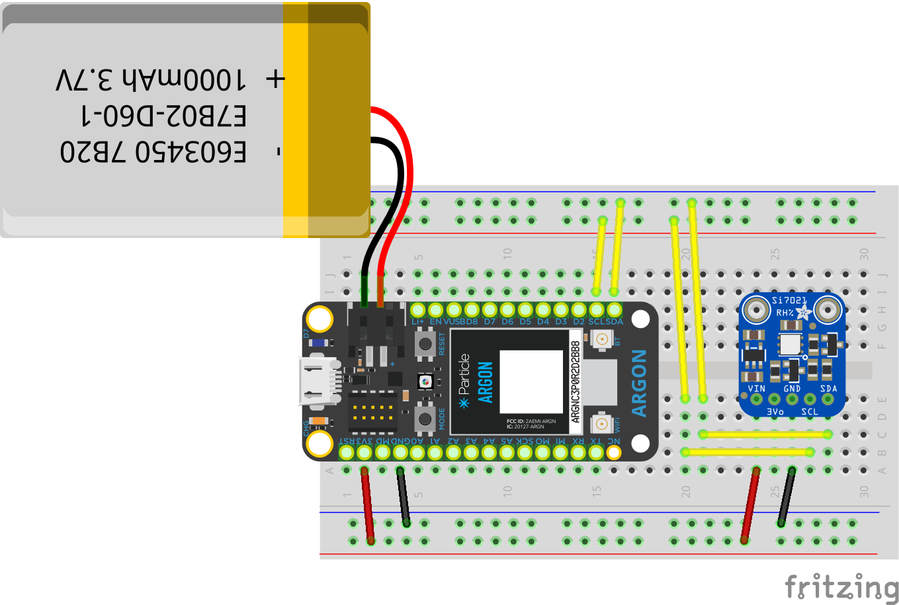

# Temperature & Humidity Notification System

The purpose of this project is to be able to notify a user via SMS when their ambient room temperature and relative humidity are in the range for discomfort and potential health risks. This is accomplished using a mixture of specified hardware and cloud technologies mentioned below.

## Hardware
- Particle Argon
- Adafruit Si7021
- Breadboard
- Jumper Wires
- Lithium Ion Polymer Battery 1000 mAh

The following is the breadboard schematic:

## Technology Stack
- Python
- Particle Cloud
- Google Cloud Platform
    - Functions
    - PubSub
    - Firestore
    - Secret Manager

## SMS Notification Rules
- Minimum 1 hour gap between each message per climate type
- Trigger only between 6AM - 9PM

## SMS Trigger Criteria
- Ambient room temperature above 75 degrees Fahrenheit or below 65 degrees Fahrenheit
- Relative humidity above 60% or below 30%
